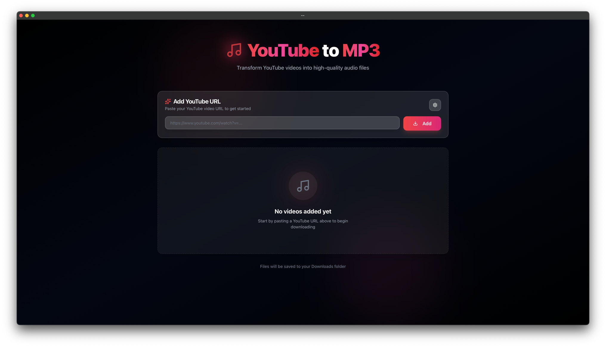
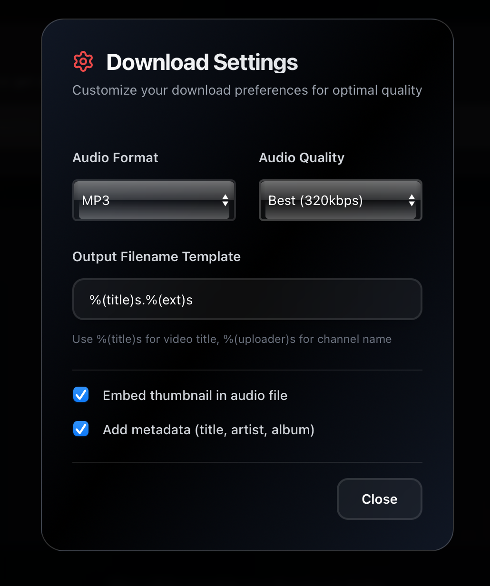

<div align="center">
  <h1>🎵 YouTube Converter</h1>
  <p><i>Convert YouTube videos to high-quality audio files with ease</i></p>
</div>

<div align="center">
  
  
  
  
    
</div>


<div align="center" style="margin-top: 20px">
  
  
</div>

---

## 📖 Overview

**YouTube Converter** is a modern, cross-platform desktop application built with Rust and Tauri that allows you to
download and convert YouTube videos to high-quality audio files. With a sleek interface and powerful backend, it
provides a seamless experience for music enthusiasts and content creators.

### 🎯 Why YouTube Converter?

- **🚀 Lightning Fast**: Built with Rust for maximum performance and minimal resource usage
- **🎨 Modern UI**: Clean, intuitive interface built with React and TailwindCSS
- **🔒 Privacy First**: All processing happens locally on your machine
- **🎵 High Quality**: Supports multiple audio formats with customizable quality settings
- **📦 Batch Downloads**: Download multiple videos simultaneously
- **🖼️ Rich Metadata**: Automatically embeds thumbnails and metadata into audio files
- **⚡ Real-time Progress**: Live progress tracking for all downloads

---

## ✨ Key Features

### Audio Conversion

- **Multiple Formats**: MP3, M4A, FLAC, WAV, and more
- **Quality Control**: Choose from 0 (best) to 9 (worst) quality settings
- **Metadata Embedding**: Automatic artist, title, and album information
- **Thumbnail Support**: Embed video thumbnails as album art

### User Experience

- **Batch Processing**: Queue multiple videos for download
- **Custom Output**: Flexible file naming templates
- **Progress Tracking**: Real-time download and conversion status
- **Error Handling**: Graceful error recovery with detailed feedback

### Technical Excellence

- **Cross-Platform**: Native support for macOS, Windows, and Linux
- **Memory Safe**: Built with Rust's zero-cost abstractions
- **Async Operations**: Non-blocking downloads with Tokio runtime
- **Unit Tested**: Comprehensive test suite with 9 passing tests

---

## 💻 Platform Support

<div align="center">
  <table>
    <tr>
      <td align="center">
        <br/>
        <sub>macOS 10.15+</sub>
      </td>
      <td align="center">
        <br/>
        <sub>Ubuntu 18.04+</sub>
      </td>
      <td align="center">
        <br/>
        <sub>Windows 10+</sub>
      </td>
    </tr>
  </table>
</div>

---

## 📋 Prerequisites

Before you begin, ensure you have the following installed:

### Required

- **[Node.js](https://nodejs.org/)** (v16 or higher)
- **[pnpm](https://pnpm.io/)** - Fast, disk space efficient package manager
- **[Rust](https://rustup.rs/)** (latest stable version)
- **[yt-dlp](https://github.com/yt-dlp/yt-dlp)** - YouTube download engine

### Installing yt-dlp

**macOS (Homebrew)**

```bash
brew install yt-dlp
```

**Linux**

```bash
# Using pip
pip install yt-dlp

# Or download binary
sudo curl -L https://github.com/yt-dlp/yt-dlp/releases/latest/download/yt-dlp -o /usr/local/bin/yt-dlp
sudo chmod a+rx /usr/local/bin/yt-dlp
```

**Windows**

```powershell
# Using winget
winget install yt-dlp

# Or using scoop
scoop install yt-dlp
```

---

## 🚀 Quick Start

### 1. Clone the Repository

```bash
git clone https://github.com/Maxime-Cllt/youtube-converter.git
cd youtube-converter
```

### 2. Install Dependencies

```bash
pnpm install
```

### 3. Run in Development Mode

```bash
pnpm tauri dev
```

### 4. Build for Production

```bash
pnpm tauri build
```

The built application will be available in `src-tauri/target/release/`.

---

## 🧪 Testing

The project includes comprehensive unit tests for the Rust backend.

### Run All Tests

```bash
cd src-tauri
cargo test
```

### Run Tests with Detailed Output

```bash
cargo test -- --nocapture
```

### Run Specific Test

```bash
cargo test test_get_downloads_dir_returns_valid_path
```

---

## 🎯 Usage

### Basic Download

1. Launch the application
2. Paste a YouTube URL
3. Select your desired audio format and quality
4. Click "Download"
5. Find your file in the Downloads folder

### Advanced Options

**Custom Output Template**

```
%(title)s.%(ext)s           # Video title + extension
%(artist)s - %(title)s      # Artist - Title format
%(playlist)s/%(title)s      # Organize by playlist
```

**Quality Settings**

- `0` - Best quality (largest file size)
- `5` - Balanced (recommended)
- `9` - Smallest size (lower quality)

**Metadata Options**

- ☑️ **Embed Thumbnail**: Add video thumbnail as album art
- ☑️ **Add Metadata**: Include artist, title, album info

---

## 🛠️ Tech Stack

### Backend (Rust)

- **[Tauri](https://tauri.app/)** - Desktop app framework
- **[Tokio](https://tokio.rs/)** - Async runtime
- **[Serde](https://serde.rs/)** - Serialization framework
- **yt-dlp** - Video download engine

### Frontend (TypeScript/React)

- **[React](https://react.dev/)** - UI framework
- **[TypeScript](https://www.typescriptlang.org/)** - Type safety
- **[TailwindCSS](https://tailwindcss.com/)** - Utility-first CSS
- **[Vite](https://vitejs.dev/)** - Build tool

---

## 📦 Building from Source

### Development Build

```bash
# Install dependencies
pnpm install

# Run in dev mode
pnpm tauri dev
```

### Production Build

```bash
# Build for your platform
pnpm tauri build

# Output locations:
# macOS: src-tauri/target/release/bundle/dmg/
# Windows: src-tauri/target/release/bundle/msi/
# Linux: src-tauri/target/release/bundle/appimage/
```

---

## 🤝 Contributing

Contributions are welcome! Here's how you can help:

### Getting Started

1. **Fork the Repository**
2. **Create a Feature Branch**
   ```bash
   git checkout -b feature/amazing-feature
   ```
3. **Make Your Changes**
   ```bash
   # Add your improvements
   git add .
   git commit -m "Add amazing feature"
   ```
4. **Run Tests**
   ```bash
   cd src-tauri && cargo test
   ```
5. **Push to Your Fork**
   ```bash
   git push origin feature/amazing-feature
   ```
6. **Open a Pull Request**

### Code Style

- Rust: Follow [Rust API Guidelines](https://rust-lang.github.io/api-guidelines/)
- TypeScript/React: Follow [Airbnb Style Guide](https://github.com/airbnb/javascript)
- Run `cargo fmt` before committing Rust code
- Run `pnpm lint` before committing frontend code

---
