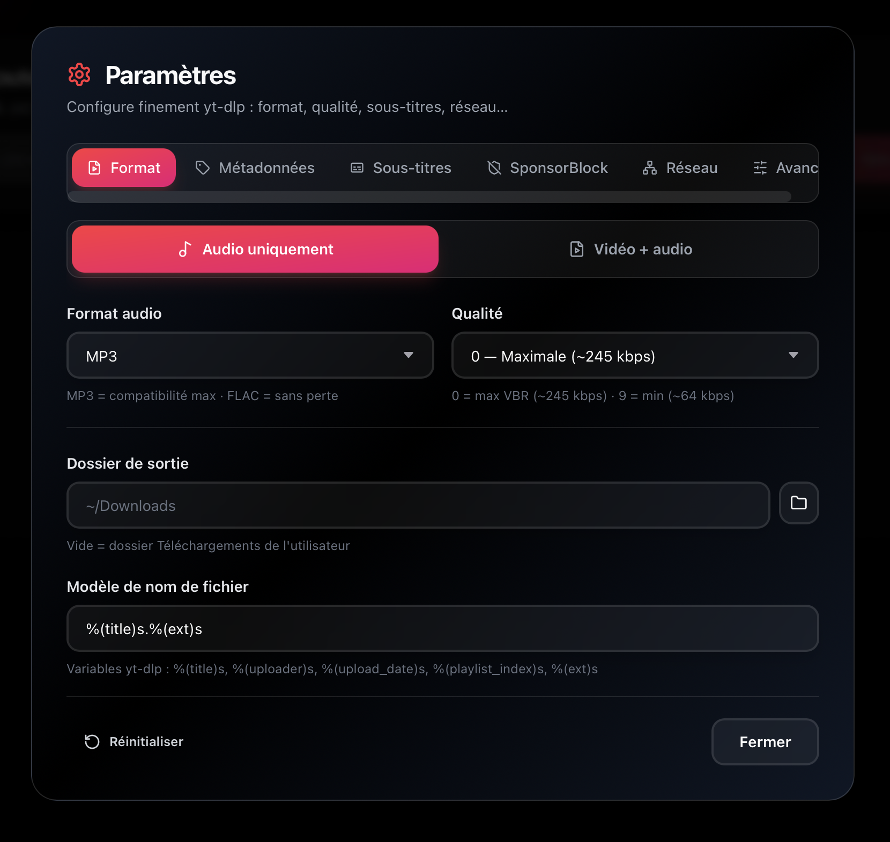
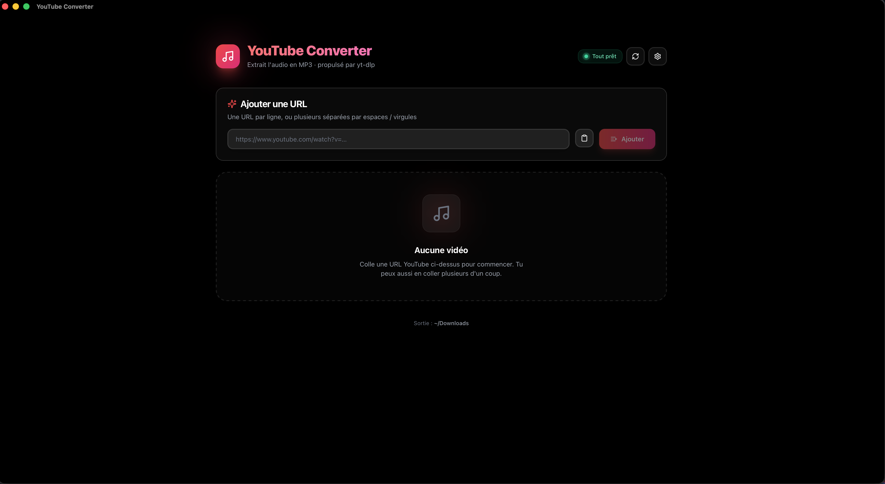

<div align="center" style="margin-top: 20px">
  
</div>

<div align="center">
  <h1>🎵 YouTube Converter</h1>
  <p><i>Download YouTube videos as MP3 or video — locally, privately, instantly</i></p>
</div>

<div align="center">
  
  
  
  
  
</div>

---

<div align="center" style="margin-top: 20px">
  
  
</div>

---

## 📖 Overview

**YouTube Converter** is a modern, cross-platform desktop application built with Rust and Tauri. It lets you download YouTube videos as high-quality audio (MP3, M4A, FLAC…) or video (MP4, MKV…) directly on your machine — no cloud, no tracking, no limits.

### 🎯 Why YouTube Converter?

- **🚀 Lightning Fast**: Rust backend with async Tokio runtime and parallel downloads
- **🎨 Modern UI**: Animated interface built with Svelte 5 and TailwindCSS
- **🔒 Privacy First**: Everything runs locally — yt-dlp processes files on your machine
- **🎵 Audio & Video**: MP3/M4A/FLAC extraction or full video download with codec/resolution control
- **📦 Batch Downloads**: Queue multiple URLs and download up to 3 in parallel
- **🖼️ Rich Metadata**: Embeds thumbnails, metadata, chapters, and subtitles
- **⚡ Real-time Progress**: Live per-video progress, speed, and ETA
- **🧹 SponsorBlock**: Automatically remove sponsors, intros, and outros

---

## ✨ Key Features

### Audio Mode

- **Multiple Formats**: MP3, M4A, FLAC, WAV, OPUS, and more
- **Quality Control**: VBR quality from 0 (best) to 9 (worst)
- **Metadata & Thumbnail**: Embeds title, artist, album art automatically
- **Chapter Support**: Embed chapter markers into the output file

### Video Mode

- **Resolution Control**: Best, 4K, 1440p, 1080p, 720p, 480p, 360p
- **Codec Selector**: H.264, H.265, VP9, AV1, or any
- **Container**: MP4, MKV, WebM, or default
- **Subtitle Embedding**: Download and embed subtitles in chosen languages

### Advanced Settings

- **SponsorBlock**: Remove sponsor segments, intros, outros, self-promos
- **Network Options**: Rate limiting, proxy, custom User-Agent, cookies file
- **Playlist Support**: Download full playlists or specific items by index
- **Custom yt-dlp Args**: Pass arbitrary extra arguments for power users
- **Output Template**: Flexible yt-dlp naming templates (`%(title)s.%(ext)s`, etc.)

### Technical Excellence

- **Cross-Platform**: Native support for macOS, Windows, and Linux
- **Memory Safe**: Built with Rust's zero-cost abstractions
- **Async Operations**: Non-blocking downloads with Tokio — up to 3 concurrent
- **Auto-detection**: Finds yt-dlp and ffmpeg on PATH, common install locations, login shell, and Python module fallback
- **Unit Tested**: Rust test suite covering progress parsing, format selectors, and option deserialization

---

## 💻 Platform Support

<div align="center">
  <table>
    <tr>
      <td align="center">
        <br/>
        <sub>macOS 10.15+</sub>
      </td>
      <td align="center">
        <br/>
        <sub>Ubuntu 18.04+</sub>
      </td>
      <td align="center">
        <br/>
        <sub>Windows 10+</sub>
      </td>
    </tr>
  </table>
</div>

---

## 📋 Prerequisites

Before you begin, ensure you have the following installed:

### Required

- **[Bun](https://bun.sh/)** (v1.1 or higher) — JavaScript runtime and package manager
- **[Rust](https://rustup.rs/)** (latest stable version)
- **[yt-dlp](https://github.com/yt-dlp/yt-dlp)** — YouTube download engine
- **[ffmpeg](https://ffmpeg.org/)** + **ffprobe** — Required for audio extraction and conversion

> The app auto-detects yt-dlp and ffmpeg at startup. It searches the system PATH, common install locations, and falls back to a login shell lookup for GUI apps on macOS.

### Installing yt-dlp

**macOS / Linux (Homebrew)**

```bash
brew install yt-dlp
```

**Linux**

```bash
# Download binary directly
sudo curl -L https://github.com/yt-dlp/yt-dlp/releases/latest/download/yt-dlp -o /usr/local/bin/yt-dlp
sudo chmod a+rx /usr/local/bin/yt-dlp
```

**Windows**

```powershell
# Using winget
winget install yt-dlp

# Or using scoop
scoop install yt-dlp
```

### Installing ffmpeg

**macOS / Linux (Homebrew)**

```bash
brew install ffmpeg
```

**Linux (apt)**

```bash
sudo apt install ffmpeg
```

**Windows**

```powershell
winget install ffmpeg
# or: scoop install ffmpeg
```

---

## 🚀 Quick Start

### 1. Clone the Repository

```bash
git clone https://github.com/Maxime-Cllt/youtube-converter.git
cd youtube-converter
```

### 2. Install Dependencies

```bash
bun install
```

### 3. Run in Development Mode

```bash
bun tauri dev
```

### 4. Build for Production

```bash
bun tauri build
```

The built application will be available in `src-tauri/target/release/`.

---

## 🧪 Testing

The project includes comprehensive unit tests for the Rust backend.

### Run All Tests

```bash
cd src-tauri
cargo test
```

### Run Tests with Detailed Output

```bash
cargo test -- --nocapture
```

### Run Specific Test

```bash
cargo test test_get_downloads_dir_returns_valid_path
```

---

## 🎯 Usage

### Basic Download

1. Launch the application — yt-dlp and ffmpeg are detected automatically
2. Paste one or more YouTube URLs (space, comma, or line-separated)
3. Open **Settings** to choose audio or video mode and configure options
4. Click **Download**
5. Files are saved to `~/Downloads` by default (configurable in Settings)

### Output Template Examples

```
%(title)s.%(ext)s             # Default: video title + extension
%(artist)s - %(title)s        # Artist - Title (from metadata)
%(playlist)s/%(title)s        # Organise by playlist name
%(upload_date)s - %(title)s   # Date prefix
```

### Audio Quality Settings

- `0` — Best quality / highest bitrate (default)
- `5` — Balanced
- `9` — Smallest file size

### SponsorBlock Categories

| Category | Description |
|----------|-------------|
| `sponsor` | Paid promotions and sponsors |
| `intro` | Intros and outros |
| `selfpromo` | Self-promotion segments |
| `interaction` | Like/subscribe reminders |
| `music_offtopic` | Non-music sections in music videos |

---

## 🛠️ Tech Stack

### Backend (Rust)

- **[Tauri v2](https://tauri.app/)** — Desktop app framework
- **[Tokio](https://tokio.rs/)** — Async runtime (parallel downloads via semaphore)
- **[Serde](https://serde.rs/)** — JSON serialization for IPC
- **yt-dlp** — Video download and extraction engine
- **ffmpeg** — Audio conversion and post-processing

### Frontend (TypeScript/Svelte)

- **[Svelte 5](https://svelte.dev/)** — Reactive UI with runes (`$state`, `$derived`, `$effect`)
- **[TypeScript](https://www.typescriptlang.org/)** — Type safety
- **[TailwindCSS](https://tailwindcss.com/)** — Utility-first CSS with custom animations
- **[Vite](https://vitejs.dev/)** — Build tool
- **[Lucide Svelte](https://lucide.dev/)** — Icon library

---

## 📦 Building from Source

### Development Build

```bash
bun install
bun tauri dev
```

### Production Build

```bash
bun tauri build

# Output locations:
# macOS:   src-tauri/target/release/bundle/dmg/
# Windows: src-tauri/target/release/bundle/msi/
# Linux:   src-tauri/target/release/bundle/appimage/
```

---

## 🤝 Contributing

Contributions are welcome! Here's how you can help:

### Getting Started

1. **Fork the Repository**
2. **Create a Feature Branch**
   ```bash
   git checkout -b feature/amazing-feature
   ```
3. **Make Your Changes**
   ```bash
   # Add your improvements
   git add .
   git commit -m "Add amazing feature"
   ```
4. **Run Tests**
   ```bash
   cd src-tauri && cargo test
   ```
5. **Push to Your Fork**
   ```bash
   git push origin feature/amazing-feature
   ```
6. **Open a Pull Request**

### Code Style

- Rust: Follow [Rust API Guidelines](https://rust-lang.github.io/api-guidelines/)
- TypeScript/Svelte: consistent with existing code style
- Run `cargo fmt` before committing Rust code
- Run `bun check` to verify Svelte TypeScript before committing

---
